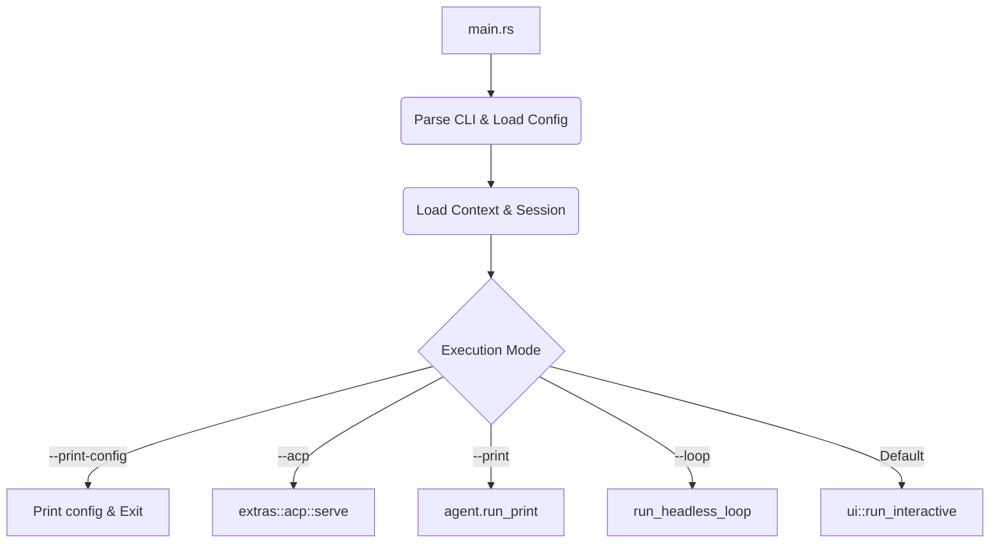
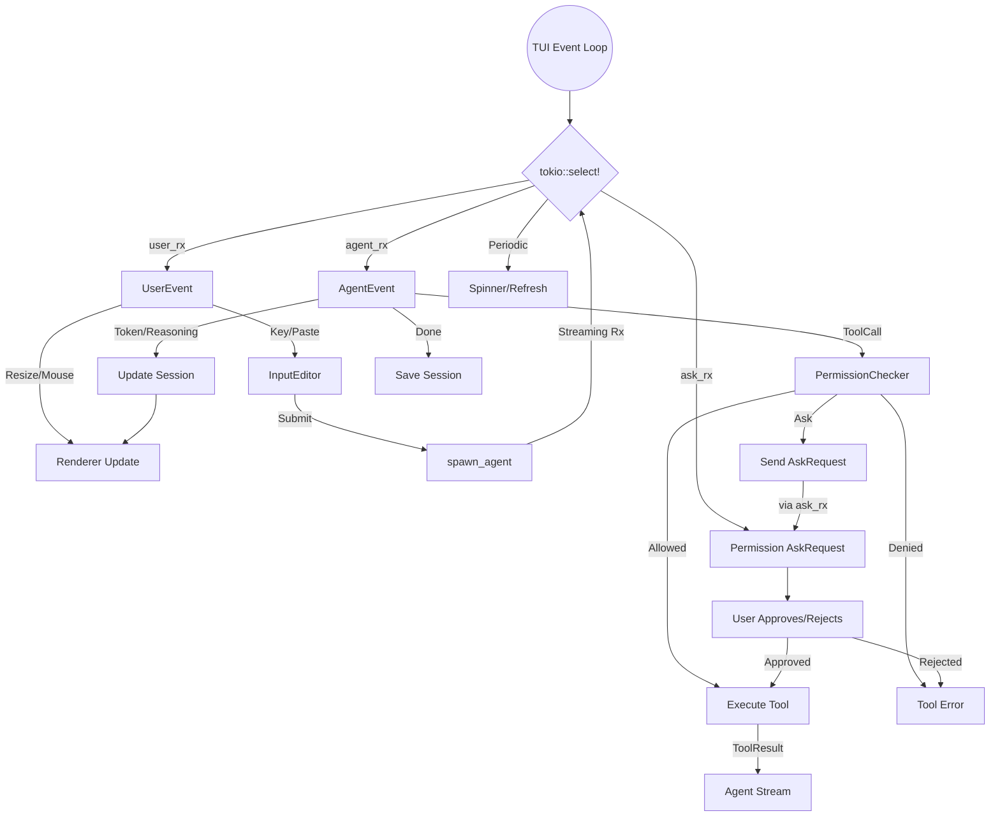
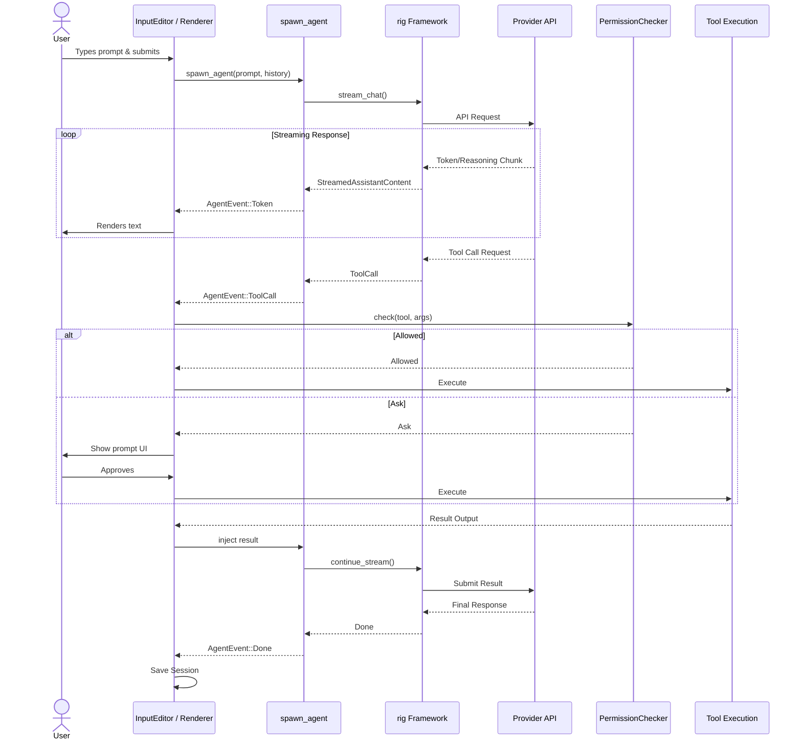

# Architecture — zerostack v1.4.0-rc2

Minimal coding agent in Rust, optimized for memory footprint and performance.
Single crate, no workspace. All source under `src/`.

## Directory Layout

| Path | Responsibility |
|---|---|
| `src/main.rs` | Entry point, CLI dispatch, mode routing |
| `src/cli.rs` | `clap::Parser` CLI argument definition |
| `src/provider.rs` | LLM provider abstraction (type-erased: `AnyClient`, `AnyModel`, `AnyAgent` enums) |
| `src/auth.rs` | API key resolution (`AuthResolver`, `ProviderKind` enum) |
| `src/event.rs` | `AgentEvent` (streaming LLM output) and `UserEvent` (TUI input) enums |
| `src/agent/` | Agent lifecycle: `builder.rs` (rig Agent construction + tool injection), `runner.rs` (spawn, stream), `prompt.rs` (system prompts), `tools/` (11 tool impls) |
| `src/session/` | Session state: `mod.rs` (messages, compactions, costs), `storage.rs` (JSON file I/O), `chat_history.rs` |
| `src/permission/` | Security: `checker.rs` (glob+regex rules, doom-loop detection), `ask.rs` (user prompt UI), `pattern.rs` |
| `src/ui/` | Custom TUI on crossterm (no ratatui): `mod.rs` (event loop), `terminal.rs` (raw mode guard), `renderer.rs` (line buffer + viewport), `input/` (text editor + pickers), `status.rs`, `markdown.rs`, `event_handler.rs`, `cmd_picker.rs` |
| `src/context/` | Context gathering: embedded prompt themes (`prompts.rs`, `themes.rs`), AGENTS.md/ARCHITECTURE.md loading |
| `src/config/` | Configuration: `load.rs` (TOML/JSON from disk+env), `types.rs` (QuickModel, CustomProvider, Colors, EditSystem) |
| `src/extras/` | Feature-gated extensions: `loop/` (headless), `mcp/` (MCP client), `acp/` (ACP server), `memory/` (persistent memory), `subagents/` (parallel task delegation), `git_worktree/`, `archmd/` |
| `src/sandbox.rs` | `bwrap`/`zerobox` command wrapping |
| `src/fs.rs` | Filesystem utilities |
| `src/pricing.rs` | Token pricing constants |

## Key Types & Relationships

- **`Config`** (`src/config/mod.rs:22`) — central deserialized config, drives all runtime behavior.
- **`Cli`** (`src/cli.rs:9`) — `clap::Parser` args, overrides `Config` fields.
- **`AnyClient` / `AnyModel` / `AnyAgent`** (`src/provider.rs:83-259`) — type-erased enums wrapping rig's provider-specific clients (OpenAI, Anthropic, Gemini, Ollama, OpenRouter). `AnyAgent` provides `run_print()` and `spawn_runner()`. No custom traits — enum dispatch replaces dynamic dispatch.
- **`AgentRunner`** (`src/agent/runner.rs:12`) — holds `mpsc::Receiver<AgentEvent>`, spawned via `spawn_agent()`.
- **`AgentEvent`** (`src/event.rs:4`) — `Token`, `Reasoning`, `ToolCall`, `ToolResult`, `SubagentToolCall`, `Error`, `Done`.
- **`UserEvent`** (`src/event.rs:27`) — `Key`, `ScrollUp/Down`, `Resize`, `Paste`, `MouseDown/Drag/Up`.
- **`Session`** (`src/session/mod.rs:39`) — serializable state: messages, compactions, costs, permission allowlist, model/provider info.
- **`PermissionChecker`** (`src/permission/checker.rs:29`) — dual-layer (glob + regex) rules, doom-loop detection, `SecurityMode` dispatch.
- **`TerminalGuard`** (`src/ui/terminal.rs:10`) — RAII for raw mode, alt screen, mouse capture.
- **`Renderer`** (`src/ui/renderer.rs:21`) — line-buffered viewport, markdown rendering, scroll/selection.
- **`InputEditor`** (`src/ui/input/mod.rs:22`) — text buffer, cursor, history, kill-ring, picker integration.
- **`ContextFiles`** (`src/context/mod.rs:56`) — loaded agents, prompts, themes, architecture docs.

## Control Flow

### Interactive TUI Event Loop (`src/ui/mod.rs`)

Single `tokio::select!` with 4 branches (line ~310):
1. **`UserEvent` from `user_rx`** — keyboard/mouse/resize/paste from background event thread (polls crossterm every 50ms)
2. **`AgentEvent` from `agent_rx`** — streaming LLM tokens, tool calls, errors
3. **Permission `AskRequest` from `ask_rx`** — user must approve/reject tool calls
4. **Periodic refresh** (100ms) — spinner animation when agent is running

Key dispatch: `InputEditor::handle_key()` → `Some(text)` triggers `spawn_agent()` → stream events via `handle_agent_event()` which writes to `Renderer` and appends to `Session`.

## Data Flow

Session is serialized to JSON files in `$XDG_DATA_HOME/zerostack/sessions/`. Chat history appended to `$XDG_DATA_HOME/zerostack/chat_history.jsonl`.

## Design Decisions

1. **Custom TUI over crossterm (no ratatui)** — keeps binary size minimal; project has its own line buffer, markdown renderer, scroll/selection. No widget tree overhead.
2. **Type-erased enums, not trait objects** — `AnyAgent` enum wraps each provider variant. Avoids `dyn CompletionModel` lifetime issues; matching on enum is faster than vtable dispatch. (`src/provider.rs:83-259`)
3. **Permission: dual-layer (glob + regex) rules** — glob for fast path, regex for complex patterns. Doom-loop detection tracks repeated identical tool calls. (`src/permission/checker.rs:29`)
4. **Session compaction** — when token count approaches context window, old messages are summarized and dropped, preserving a summary prefix. (`src/session/mod.rs:24`)
5. **Feature-gated extras** — `loop`, `mcp`, `acp`, `memory`, `subagents`, `git-worktree`, `archmd` are all compile-time features. Extras don't bloat the core binary.
6. **Single-threaded tokio by default** — `#[tokio::main(flavor = "current_thread")]` unless `multithread` feature enabled. Keeps resource usage low for a CLI tool.

## Dependencies

| Crate | Use |
|---|---|
| `rig 0.37` | Agent framework: prompt hooks, tool system, streaming, provider clients (OpenAI, Anthropic, Gemini, Ollama, OpenRouter) |
| `clap 4` | Derive-based CLI argument parsing (`src/cli.rs:9`) |
| `crossterm 0.29` | Terminal raw mode, color, cursor, mouse, paste events — TUI foundation |
| `tokio 1` | Async runtime (current_thread default), channels (`mpsc`), process, fs |
| `serde + serde_json + toml` | Config (TOML/JSON), session serialization (JSON) |
| `chrono`, `uuid` | Session timestamps and IDs |
| `pulldown-cmark 0.13` | Markdown → styled lines for TUI rendering |
| `ignore 0.4` | `.gitignore`-aware file traversal (`find_files` tool) |
| `regex 1` | Permission pattern matching |
| `reqwest 0.13` | HTTP client (provider API calls via rig) |
| `tracing + tracing-subscriber` | Structured logging (`RUST_LOG`, `RUST_LOG_FILE` env vars) |
| `mimalloc` | Global allocator (size + speed) |
| `compact_str`, `smallvec` | Heap-efficient small-string/small-vector types |

Optional (`mcp` feature): `rmcp 1.7` (MCP client with child-process + HTTP transport). Optional (`acp` feature): `agent-client-protocol 0.12`.

## Entry Points

- **`main()`** (`src/main.rs:83`) — all modes dispatch from here
- **`--print`** / `-p` — `agent.run_print()` → single reply, then exit (`main.rs:243`)
- **`--loop`** — `run_headless_loop()` → iterative prompt/validate loop (`main.rs:262`)
- **`--acp`** — `extras::acp::serve()` → ACP server mode (`main.rs:210`)
- **Default (no flags)** — `ui::run_interactive()` → full TUI (`main.rs:295`)
- **`--resume`** / `--continue` / `--session <id>` — loads prior session before entering TUI/print
